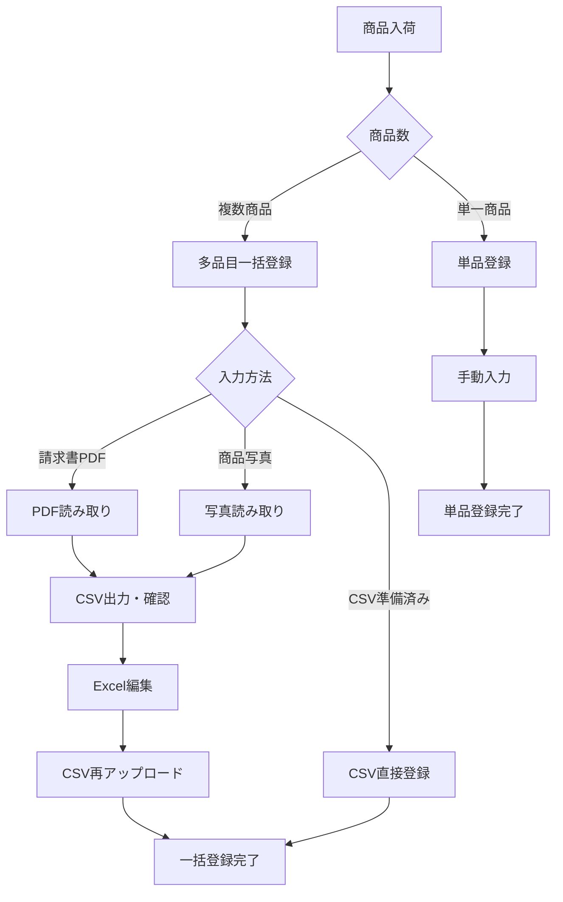

# みどり楽器 在庫管理システム 設計書

## 📋 システム概要

### システム名
みどり楽器在庫管理システム

### 目的
楽器店「みどり楽器」における商品在庫の効率的な管理と登録の自動化

### 技術スタック
- **フロントエンド**: Next.js 15 + React + TypeScript
- **スタイリング**: Tailwind CSS
- **データベース**: Supabase (PostgreSQL)
- **開発サーバー**: http://localhost:3000

---

## 🏗️ システム構成

### 1. ページ構成

```
📂 みどり楽器在庫管理システム
├── 🏠 ダッシュボード (/)
├── 📦 在庫一覧 (/inventory)
├── ➕ 単品商品登録 (/inventory/add)
└── 📄 多品目一括登録 (/inventory/bulk-import) ⭐メイン機能
```

### 2. データベース設計

#### `inventory` テーブル (全13フィールド)

| フィールド名 | 型 | 必須 | 説明 |
|-------------|-----|------|------|
| `id` | UUID | ✅ | 主キー |
| `category` | VARCHAR | ✅ | カテゴリ |
| `product_name` | VARCHAR | ✅ | 商品名 |
| `manufacturer` | VARCHAR | ✅ | メーカー・ブランド |
| `model_number` | VARCHAR | ✅ | 型番・シリアル |
| `color` | VARCHAR | ✅ | カラー |
| `condition` | VARCHAR | ✅ | 状態 |
| `price` | INTEGER | ✅ | 販売価格（円） |
| `supplier` | VARCHAR | ❌ | 仕入先 |
| `list_price` | INTEGER | ❌ | 定価（円） |
| `wholesale_price` | INTEGER | ❌ | 卸価格（円） |
| `wholesale_rate` | DECIMAL | ❌ | 卸率（%） |
| `gross_margin` | INTEGER | ❌ | 粗利（円） |
| `notes` | TEXT | ❌ | 備考 |
| `created_at` | TIMESTAMP | ✅ | 登録日時 |

---

## 📱 機能詳細

### 🏠 1. ダッシュボード
- システムのメイン入口
- 各機能へのナビゲーション

### 📦 2. 在庫一覧ページ `/inventory`

#### 主な機能
- 📊 全商品一覧表示（13フィールド対応）
- 🔍 検索・フィルタ機能
  - キーワード検索（商品名、メーカー、型番）
  - カテゴリフィルタ
  - メーカーフィルタ
  - カラーフィルタ
- 📈 集計表示（商品数、総額）
- 📤 エクスポート機能
  - CSV出力
  - Excel出力

#### ヘッダーボタン
```
[📄 多品目一括登録] [CSVインポート] [CSV出力] [Excel出力] [単品追加] [ダッシュボードに戻る]
```

### ➕ 3. 単品商品登録ページ `/inventory/add`

#### 登録方法（4種類）
1. **📊 CSV一括登録** - 既存CSVファイルから
2. **📄 PDF自動読取** - 単一PDF/カタログから
3. **📷 写真読取** - 単一商品ラベル写真から
4. **✏️ 手動入力** - フォーム直接入力

#### 特徴
- 全13フィールド対応フォーム
- 自動計算機能（卸率、粗利）
- バリデーション機能

### 📄 4. 多品目一括登録ページ `/inventory/bulk-import` ⭐

#### ワークフロー（2ステップ）

```
ステップ1: 多品目読み取り
┌─────────────────┐    ┌─────────────────┐
│  📄 PDF読み取り  │ OR │ 📷 写真読み取り │
│  請求書・カタログ │    │ 複数商品ラベル  │
└─────────────────┘    └─────────────────┘
                ↓
ステップ2: CSV確認・一括登録
┌─────────────────┐    ┌─────────────────┐
│   📊 CSV出力     │ OR │  🚀 直接登録    │
│  Excel確認・編集 │    │   一括データ    │
└─────────────────┘    └─────────────────┘
```

#### 機能詳細

**PDF読み取り機能:**
- 複数商品を含む請求書・カタログPDFを処理
- 自動で商品情報を抽出（現在はモックデータ）
- 結果をテーブル表示
- CSV出力ボタン付き

**写真読み取り機能:**
- 複数枚の商品ラベル写真を同時処理
- 画像プレビュー機能
- OCR処理で商品情報抽出（現在はモックデータ）
- CSV出力ボタン付き

**CSV確認・一括登録:**
- 読み取った商品データの確認
- CSV出力してExcelで編集可能
- 編集済みCSVの再アップロード
- 直接一括登録機能

---

## 🔧 API構成

### エンドポイント一覧

| エンドポイント | メソッド | 説明 | 状態 |
|---------------|---------|------|------|
| `/api/csv-import` | POST | CSV一括インポート | ✅ 実装済み |
| `/api/pdf-extract` | POST | 単一PDF読み取り | 🔶 モック |
| `/api/multiple-pdf-extract` | POST | 多品目PDF読み取り | 🔶 モック |
| `/api/ocr` | POST | 単一画像OCR | 🔶 未実装 |
| `/api/multiple-ocr` | POST | 多品目画像OCR | 🔶 モック |

### モックデータ例

**多品目PDF読み取り（5商品）:**
1. YAMAHA FG830 アコースティックギター - ¥35,000
2. Fender Jazz Bass - ¥85,000
3. TAMA Imperialstar スネアドラム - ¥28,000
4. CASIO CT-S300 電子キーボード - ¥18,000
5. BOSS OD-1 オーバードライブ - ¥8,000

---

## 📊 コンポーネント構成

### メインコンポーネント

```
📂 src/components/
├── 📄 CSVImport.tsx                 # CSV一括インポート
├── 📷 ImageOCR.tsx                  # 単一画像OCR
├── 📄 PDFExtractor.tsx              # 単一PDF読み取り
├── 📄 MultiplePDFExtractor.tsx      # 多品目PDF読み取り ⭐
├── 📷 MultipleImageOCR.tsx          # 多品目画像OCR ⭐
└── 📊 CSVBulkRegister.tsx           # CSV一括登録 ⭐
```

### ページコンポーネント

```
📂 src/app/
├── 🏠 page.tsx                      # ダッシュボード
├── 📦 inventory/page.tsx            # 在庫一覧
├── ➕ inventory/add/page.tsx        # 単品登録
└── 📄 inventory/bulk-import/page.tsx # 多品目一括登録 ⭐
```

---

## 🎯 システムの特徴

### 1. 多品目処理中心の設計
- **メイン機能**: 多品目一括登録
- **補助機能**: 単品登録
- 効率的な大量商品登録が可能

### 2. 柔軟な入力方法
- PDF（請求書・カタログ）
- 写真（商品ラベル・複数枚対応）
- CSV（Excel編集対応）
- 手動入力

### 3. CSV出力による確認フロー
- AI読み取り結果をCSV出力
- Excelで人間が確認・編集
- 確認済みデータを一括登録
- **品質保証**と**効率性**の両立

### 4. 完全な13フィールド対応
- 基本情報（カテゴリ、商品名、メーカー、型番、カラー、状態、価格）
- 仕入情報（仕入先、定価、卸価格、卸率、粗利）
- 追加情報（備考）

---

## 🚀 今後の拡張予定

### 1. AI機能の実装
- [ ] 実際のPDF解析ライブラリ統合
- [ ] OCR機能の実装
- [ ] 商品情報の精度向上

### 2. 機能拡張
- [ ] 商品編集機能
- [ ] 在庫数管理
- [ ] 売上管理
- [ ] レポート機能

### 3. UI/UX改善
- [ ] モバイル最適化
- [ ] アクセシビリティ向上
- [ ] パフォーマンス最適化

---

## 📝 運用フロー

### 推奨ワークフロー



---

## 💡 システムの価値

1. **効率性**: 従来の手動入力から大幅な時間短縮
2. **正確性**: CSV確認フローによる品質保証
3. **柔軟性**: 多様な入力方法に対応
4. **拡張性**: 将来的な機能追加に対応可能な設計
5. **使いやすさ**: 直感的なUI/UX設計

---

*このシステムは楽器店「みどり楽器」の業務効率化を目的として設計・開発されています。*